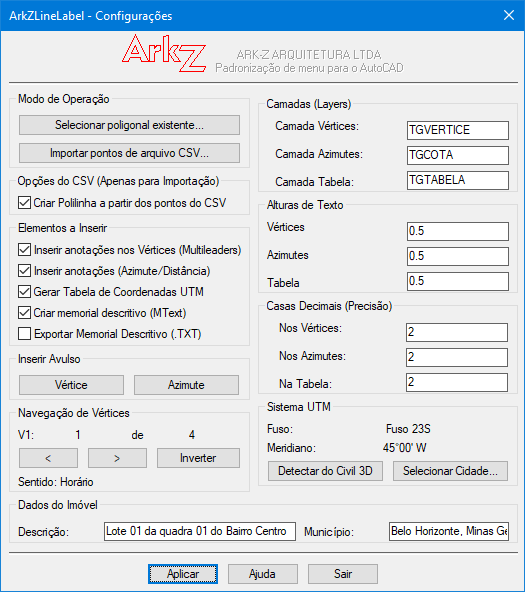
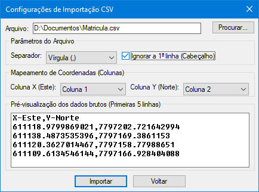
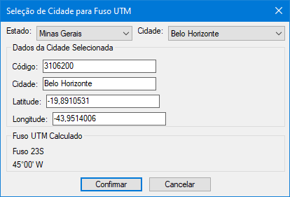
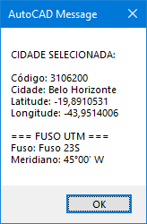

# ArkZLineLabel

<div align="center">

**Rotulagem, Tabelas e Georreferenciamento UTM para AutoCAD/Civil 3D**

<!-- Plataforma e compatibilidade -->
[](https://www.autodesk.com)
[](https://www.autodesk.com)

<!-- Informações do projeto -->

[](LICENSE)
[](https://github.com/em-rezende/ArkZLineLabel-Autocad/releases)
[](https://github.com/em-rezende/ArkZLineLabel-Autocad/releases/latest/download/ArkZLineLabel_Setup.exe)

</div>

---

## 📋 Índice

- [Sobre](#sobre)
- [Funcionalidades](#funcionalidades)
- [Novidades da Versão 2.0.0](#novidades-da-versão-200)
- [Requisitos](#requisitos)
- [Download](#download)
- [Instalação](#instalação)
- [Como Usar](#como-usar)
- [Comandos Disponíveis](#comandos-disponíveis)
- [Estrutura do Projeto](#estrutura-do-projeto)
- [Licença](#licença)
- [Autor](#autor)

---

## Sobre

**ArkZLineLabel** é uma rotina profissional para AutoCAD e Civil 3D desenvolvida em AutoLISP que automatiza o processo de rotulagem, geração de tabelas UTM e memorial descritivo de polilinhas. O sistema permite:

- ✅ Selecionar polilinhas existentes ou importar dados de arquivos CSV/TXT
- ✅ Navegar visualmente pelos vértices com teclas TAB e Setas
- ✅ Definir o Vértice Inicial (V1) e o sentido da numeração com botão "Inverter"
- ✅ Calcular automaticamente Fuso UTM e Meridiano Central via seleção de cidade ou detecção do Civil 3D
- ✅ Gerar tabela de coordenadas UTM, azimutes, distâncias e **suporte a curvas (bulges)**
- ✅ Produzir memorial descritivo completo em **MText** ou **arquivo TXT**
- ✅ Comandos em lote para **fechar** e **verificar** polilinhas

---

## Interface Gráfica

A interface do ArkZLineLabel foi projetada para ser intuitiva e eficiente, com todos os controles organizados em painéis lógicos. Abaixo estão as principais telas do sistema:

### Figura 1: Interface Principal com Modo Seleção e Navegação de Vértices



*Figura 1: Interface principal do ArkZLineLabel com destaque para o modo de seleção de polilinha, navegação de vértices (V1), opções de elementos a inserir e configurações de camadas, alturas de texto e precisão.*

A tela principal exibe:
- **Modo de Operação:** Selecionar poligonal existente ou importar CSV
- **Navegação de Vértices:** Indicação do V1 atual, total de vértices, botões de navegação (< e >) e botão "Inverter" para inversão de sentido
- **Elementos a Inserir:** Opções para ativar/desativar vértices (Multileaders), azimutes, tabela UTM, memorial MText e exportação TXT
- **Camadas (Layers):** Definição das camadas para vértices, azimutes e tabela
- **Alturas de Texto:** Controle das alturas para vértices, azimutes e tabela
- **Casas Decimais:** Precisão personalizada para vértices, azimutes e tabela
- **Sistema UTM:** Exibição do fuso e meridiano atuais, com botões para detectar do Civil 3D ou selecionar cidade
- **Dados do Imóvel:** Campos para descrição do imóvel e município

### Figura 2: Módulo de Importação CSV com Pré-visualização



*Figura 2: Diálogo dedicado à importação de arquivos CSV/TXT com pré-visualização das primeiras 5 linhas e opções de configuração.*

O módulo de importação CSV oferece:
- **Seleção de Arquivo:** Botão "Procurar..." para navegar até o arquivo desejado
- **Parâmetros do Arquivo:** Seleção do separador (vírgula, ponto e vírgula ou tabulação) e opção para ignorar a primeira linha (cabeçalho)
- **Mapeamento de Coordenadas:** Menus suspensos para associar as colunas corretas ao Eixo X (Este) e Eixo Y (Norte)
- **Pré-visualização:** Lista com as primeiras 5 linhas do arquivo para validação visual
- **Botões de Ação:** "Importar" para processar os dados ou "Voltar" para retornar à tela principal

### Figura 3: Seleção de Cidade e Cálculo Automático de Fuso UTM



*Figura 3: Diálogo de seleção de cidade com base no banco de dados de municípios brasileiros (SIRGAS 2000) e cálculo automático do fuso UTM.*

A tela de seleção de cidade permite:
- **Seleção por Estado:** Lista suspensa com todos os estados brasileiros
- **Seleção por Cidade:** Lista suspensa com os municípios do estado selecionado
- **Dados da Cidade:** Exibição do código IBGE, nome, latitude e longitude
- **Fuso UTM Calculado:** Exibição automática do fuso (ex: "Fuso 23S") e meridiano central (ex: "45°00' W") com base na longitude da cidade
- **Botão "Confirmar":** Aplica a cidade selecionada e retorna à tela principal com os dados atualizados

### Figura 4: Alerta de Confirmação dos Dados SIRGAS 2000



*Figura 4: Alerta de confirmação exibido após a seleção da cidade, apresentando todos os dados calculados para validação do usuário.*

O alerta de confirmação exibe:
- **Dados da Cidade:** Código IBGE, nome da cidade, latitude e longitude
- **Fuso UTM:** Fuso calculado (ex: "Fuso 22N" ou "Fuso 23S")
- **Meridiano Central:** Meridiano central correspondente (ex: "45°00' W")
- **Confirmação Visual:** Permite ao usuário verificar se os dados estão corretos antes de prosseguir

---
## Funcionalidades

### 🎯 Navegação por Vértices
- Seleção da polilinha com ocultação do DCL
- Navegação visual com teclas **TAB** ou **Setas** (↑/↓/←/→)
- Destaque em tempo real com `grdraw` no vértice selecionado
- Definição precisa do Vértice Inicial (V1)

### 🌍 Sistema de Coordenadas
- **Seleção de Cidade:** Banco de dados com mais de 5.500 municípios brasileiros (SIRGAS 2000)
- **Cálculo Automático:** Fuso UTM e Meridiano Central por fórmula matemática oficial
- **Detecção Civil 3D:** Leitura automática da variável `CGEOCS`
- **Hemisfério:** Determinação automática (N/S) baseada na latitude

### 📐 Processamento Geométrico
- **Verificação de Fecho:** Detecta polilinhas abertas e oferece fechamento automático com confirmação interativa
- **Inversão de Sentido:** Botão "Inverter" para inverter a ordem dos vértices (horário/anti-horário)
- **Suporte a Curvas (Bulges):** Detecção automática de curvas com cálculo de Raio, Desenvolvimento, Tangente e Ângulo Central
- **Área e Perímetro:** Cálculo automático da área e perímetro da polilinha

### 📊 Geração de Dados
- **Tabela UTM:** Colunas: VÉRTICE, NORTE, ESTE, DE, PARA, AZIMUTE/RAIO, DISTÂNCIA
- **Memorial Descritivo:** Texto completo com dados do imóvel, coordenadas, área, perímetro e sistema de referência
- **Exportação CSV:** Exporta a tabela de coordenadas para arquivo CSV estruturado
- **Exportação TXT:** Exporta o memorial descritivo para arquivo de texto
- **Anotações:** Multileaders (MLEADER) para vértices com coordenadas N/E

### 📁 Importação CSV
- **Múltiplos Separadores:** Vírgula (,), Ponto e Vírgula (;) ou Tabulação (Tab)
- **Mapeamento Flexível:** Definição de quais colunas representam X (Este) e Y (Norte)
- **Filtro de Cabeçalho:** Opção para ignorar a primeira linha do arquivo
- **Pré-visualização:** Exibição das primeiras 5 linhas do arquivo no diálogo de importação

---

## Novidades da Versão 2.0.0

| Funcionalidade | Descrição |
|----------------|-----------|
| 🔄 **Navegação por Vértices** | Teclas TAB/Setas com destaque grdraw |
| 🎯 **Definição de V1** | Spinner e navegação visual para definir o vértice inicial |
| 🔀 **Inversão de Sentido** | Botão "Inverter" para inverter a ordem dos vértices |
| 🧠 **Detecção Civil 3D** | Leitura automática via variável CGEOCS |
| 📐 **Verificação de Fecho** | Detecção e fechamento automático de polilinhas com confirmação interativa |
| 📤 **Exportação CSV** | Exportação da tabela de coordenadas |
| 📝 **Exportação TXT** | Exportação do memorial descritivo para arquivo TXT |
| 📐 **Suporte a Curvas** | Detecção automática de bulges com cálculo de raio e desenvolvimento |
| ✏️ **MLEADER** | Anotação de vértices com Multileaders |
| 👁️ **Pré-visualização CSV** | Exibição das primeiras 5 linhas no diálogo de importação |
| 🔧 **Comandos em Lote** | ARKZFECHAR e ARKZVERIFICAR para operações em lote |
| ⚡ **Otimização** | Desligamento de REGENMODE e CMDECHO para melhor performance |

---

## Download

O instalador é publicado como **release** deste repositório — o arquivo `.exe` não é versionado no Git.

| Versão | Build | Arquivo | Link |
|--------|-------|---------|------|
| **2.0.0** | 260911 | `ArkZLineLabel_Setup.exe` | [⬇ Baixar o instalador](https://github.com/em-rezende/ArkZLineLabel-Autocad/releases/latest/download/ArkZLineLabel_Setup.exe) |

- 📄 **Todas as versões:** [Releases](https://github.com/em-rezende/ArkZLineLabel-Autocad/releases)
- 🔒 **O link acima é permanente:** aponta sempre para o instalador da release mais recente.
- 🏷️ Para baixar uma versão específica, use a página da release, ex.: [v2.0.0](https://github.com/em-rezende/ArkZLineLabel-Autocad/releases/tag/v2.0.0).
- 🧾 **Integridade:** cada release traz o arquivo `SHA256SUMS.txt` com o hash do instalador para conferência.

---

## Requisitos

- **AutoCAD** 2020 ou superior (incluindo versões com suporte a LISP)
- **Civil 3D** 2020 ou superior (opcional, para detecção automática de zona)
- **Arquivos de suporte:**
  - `ArkZLineLabel.lsp` - Código principal
  - `ArkZLineLabel.dcl` - Interface DCL
  - `ArkZLineLabel.csv` - Base de dados de cidades (IBGE)
  - `ArkZLineLabel.txt` - Arquivo de ajuda (opcional)
  - `ArkZLineLabel.slb` - Biblioteca de slides (logo)
  - `ArkZLineLabel.cuix` - Arquivo de personalização CUIx (opcional)

---

## Instalação

### 1. Baixe o projeto

Para instalar, baixe o instalador na seção [Download](#download). Para obter o código-fonte:

```bash
git clone https://github.com/em-rezende/ArkZLineLabel-Autocad.git
```

### 2. Execute o instalador

O instalador InnoSetup é distribuído pela página de [Releases](https://github.com/em-rezende/ArkZLineLabel-Autocad/releases):

1. Baixe o arquivo `ArkZLineLabel_Setup.exe`
2. Clique com o botão direito e escolha **Executar como administrador**
3. Siga as instruções do instalador

O plugin será instalado em:
```
C:\Program Files\Autodesk\ApplicationPlugins\ArkZLineLabel.bundle\
```

### 3. Instalação Manual (Alternativa)

Copie os arquivos para uma das pastas de suporte do AutoCAD:

```
C:\Program Files\Autodesk\AutoCAD 2026\Support\
```
ou
```
C:\Users\[SeuUsuário]\AppData\Roaming\Autodesk\AutoCAD 2026\R24.3\enu\Support\
```

### 4. Carregue o programa

No AutoCAD, digite:

```lisp
(load "ArkZLineLabel.lsp")
```

Ou adicione ao arquivo `acaddoc.lsp` para carregamento automático:

```lisp
(if (findfile "ArkZLineLabel.lsp") (load "ArkZLineLabel.lsp"))
```

---

## Como Usar

### Executando o Programa

1. No AutoCAD, digite o comando:

```
ARKZLINELABEL
```

2. Selecione uma polilinha existente ou importe um arquivo CSV

3. Navegue pelos vértices com **TAB** ou **Setas** para definir o V1

4. Configure as opções desejadas (camadas, alturas, precisão, etc.)

5. Clique em **"Aplicar"** para gerar as anotações, tabela e memorial

### Fluxo de Trabalho

```
ARKZLINELABEL
   │
   ├── Modo Seleção
   │   ├── Selecionar Polilinha (botão)
   │   ├── Navegar Vértices (TAB/Setas)
   │   ├── Definir V1 e Sentido (botão "Inverter")
   │   └── Aplicar → Gera anotações
   │
   └── Modo CSV
       ├── Selecionar arquivo CSV/TXT
       ├── Configurar separador e colunas
       ├── Pré-visualizar dados (5 primeiras linhas)
       ├── Importar pontos
       └── Aplicar → Cria polilinha e anotações
```

### Exemplo de Uso

1. **Selecione uma polilinha:**

```
ARKZLINELABEL
Clique em "Selecionar Polilinha na Tela"
Selecione a polilinha no desenho
```

2. **Navegue para definir V1:**

```
Pressione TAB para avançar entre os vértices
Pressione ENTER para confirmar o V1 selecionado
```

3. **Configure as opções:**

```
Defina: camadas, alturas de texto, casas decimais
Selecione: cidade ou detecte do Civil 3D
```

4. **Aplique:**

```
Clique em "Aplicar"
Especifique a posição da tabela e do memorial
```

---

## Comandos Disponíveis

| Comando | Descrição |
|---------|-----------|
| `ARKZLINELABEL` | Executa o programa principal com navegação de vértices |
| `ARKZCONFIG` | Configura automaticamente o ambiente (estilos, camadas, etc.) |
| `ARKZSAVEZONE` | Salva a zona UTM no dicionário do desenho |
| `SELECTCITY` | Seleciona cidade e calcula o fuso UTM |
| `ARKZVTX` | Insere um vértice avulso (MLEADER) |
| `ARKZAZI` | Insere um azimute avulso |
| `ARKZTESTCSV` | Testa o carregamento da base de cidades |
| `ARKZFECHAR` | Fecha polilinhas selecionadas em lote |
| `ARKZVERIFICAR` | Verifica e lista polilinhas abertas no desenho |
| `ARKZDEBUGBULGE` | Depura bulges da polilinha selecionada (diagnóstico) |

---

## Estrutura do Projeto

```
ArkZLineLabel/
├── Fonts/                                    # Fonte da interface (bundle AutoCAD)
│   ├── Contents/
│   │   ├── Resources/
│   │   │   ├── Ark-Z.ico                      # Ícone do programa
│   │   │   ├── ArkZLineLabel_01.png           # Captura de tela 1
│   │   │   ├── ArkZLineLabel_02.png           # Captura de tela 2
│   │   │   ├── ArkZLineLabel_03.png           # Captura de tela 3
│   │   │   ├── ArkZLineLabel_04.png           # Captura de tela 4
│   │   │   ├── Index.htm                      # Página de documentação
│   │   │   └── style.css                      # Estilos CSS da documentação
│   │   └── Windows/
│   │       ├── ArkZLineLabel.csv              # Base de dados de cidades (IBGE)
│   │       ├── ArkZLineLabel.cuix             # Arquivo de personalização CUIx
│   │       ├── ArkZLineLabel.dcl              # Interface DCL
│   │       ├── ArkZLineLabel.lsp              # Código principal AutoLISP
│   │       ├── ArkZLineLabel.slb              # Biblioteca de slides (logo)
│   │       └── ArkZLineLabel.txt              # Arquivo de ajuda
│   └── PackageContents.xml                    # Manifesto do bundle AutoCAD
│
├── Output/                                    # Saída de compilação (não versionada - ver Releases)
│   └── ArkZLineLabel_v_260911_Setup.exe       # Instalador gerado e anexado à release v2.0.0
│
├── Support/
│   ├── Ark-Z.ico                              # Ícone do programa
│   ├── ArkZ_large.bmp                         # Imagem grande para CUIx
│   └── ArkZ_small.bmp                         # Imagem pequena para CUIx
│
├── Install ArkZLineLabel.iss                  # Script de instalação InnoSetup
├── Instrucoes.txt                             # Instruções de instalação
├── LICENSE                                    # Licença GNU GPLv3
├── README.MD                                  # Este arquivo
└── .gitignore                                 # Arquivos ignorados pelo Git (saída de compilação, etc.)
```

---

## Licença

Este projeto está licenciado sob a Licença GNU GPLv3 - veja o arquivo [LICENSE](LICENSE) para detalhes.

---

## Autor

**ARK-Z ARQUITETURA LTDA**

- **Desenvolvedor:** Ezequiel M. Rezende
- **Versão:** 2.0.0
- **Data:** Setembro 2026
- **Website:** [https://em-rezende.github.io/Ark-Z-Arquitetura.github.io/](https://em-rezende.github.io/Ark-Z-Arquitetura.github.io/)
- **Email:** emrezende@gmail.com

---

## Contribuições

Contribuições são bem-vindas! Para contribuir:

1. Faça um Fork do projeto
2. Crie uma branch para sua feature (`git checkout -b feature/nova-funcionalidade`)
3. Commit suas mudanças (`git commit -m 'Adiciona nova funcionalidade'`)
4. Push para a branch (`git push origin feature/nova-funcionalidade`)
5. Abra um Pull Request

---

## Agradecimentos

- **Autodesk** pela plataforma AutoCAD e Civil 3D
- **IBGE** pela base de dados de municípios brasileiros
- Comunidade AutoLISP pelo suporte e documentação

---

<div align="center">

**Feito com ❤️ por ARK-Z ARQUITETURA LTDA**

[⬆ Voltar ao topo](#arkzlinelabel)

</div>

---

## 📝 Resumo das Modificações

| Item | Alteração |
|------|-----------|
| **Funcionalidades** | Adicionado suporte a curvas (bulges), fechamento automático interativo, exportação TXT, pré-visualização CSV |
| **Novidades v2.0.0** | Adicionados itens: Suporte a Curvas, Exportação TXT, Pré-visualização CSV, Comandos em Lote |
| **Comandos Disponíveis** | Adicionados: `ARKZVERIFICAR` e `ARKZDEBUGBULGE` |
| **Distribuição** | Instalador InnoSetup (`.exe`) publicado como **GitHub Release** (não versionado no Git) |
| **Estrutura do Projeto** | Refletida a estrutura real do repositório (`Fonts/`, `Output/`, `Support/`, etc.) |
| **Instalação** | Download pela página de Releases + instalação manual alternativa |
| **Detalhes Técnicos** | Especificado que a tabela exibe "R=XX,XXm" para curvas |
| **Licença** | Mantida MIT com créditos atualizados |
| **Contato** | Atualizado com email e website reais |

